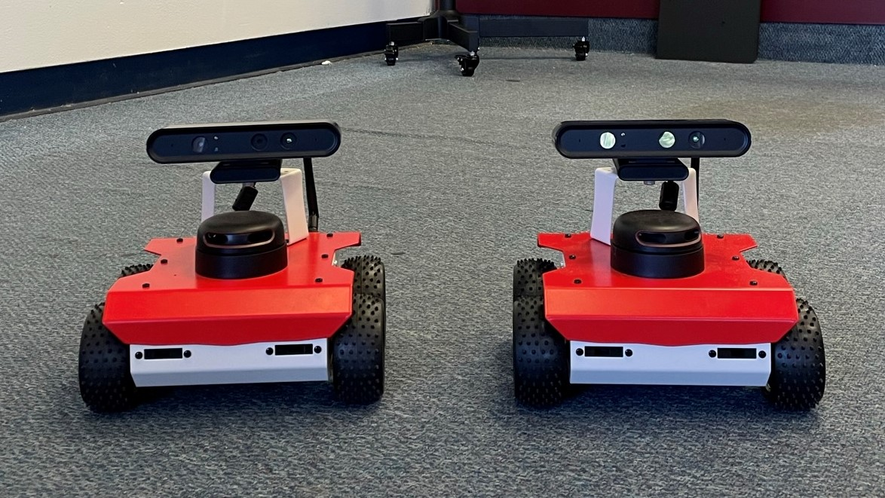
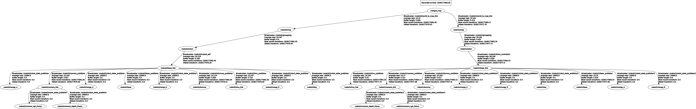

# Multi-agent SLAM using ROSBots
A ROS package for multi agent SLAM using ROSBots by Husarion



## Overview ##
This package contains launch files and nodes needed for collaborative SLAM by multiple agents in an unknown environment using ROSBots by Husarion.

## Dependencies ##
Environment
- `Ubuntu 18.04`
- `ROS Melodic`

ROS packages:
- `husarion_ros`
- `rosbot_description`
- `rosbot_ekf`
- `multirobot_map_merge`
- `gmapping`
- `explore_lite`
- `rplidar ros`

## Setup ##
A single central computer will act as a central hub (ROS master) and all the ROSBots will communicate with it by connecting to a common LAN network. Steps on setting up the communication network can be found [here](https://husarion.com/tutorials/ros-tutorials/5-running-ros-on-multiple-machines).

This can alternatively be aceived by [Husarnet](https://husarnet.com/) (a Peer-to-Peer VPN client) using Internet instead of the LAN network. 

## Usage
The central hub is used to SSH into each of the ROSbots to launch the required nodes.
```
    ssh husarion@192.168.0.11
    ssh husarion@192.168.0.22
```

Run the following commands on respective systems:

On central hub computer:
```
    roscore
```
On ROSBot 1:
```
    roslaunch multi_rosbot_SLAM robo1_explore.launch 
```
On ROSBot 2:
```
    roslaunch multi_rosbot_SLAM robo2_explore.launch 
```

Run Rviz on the central hub:
```
    rviz rviz/rosbot.rviz
```

To Save a completed merged map:
```
    rosrun map_server map_saver map:=/merged_map -f <output_filename>
```

Follow this [link](https://youtu.be/CRFiTtZXsXA) to see the visualization of `multirobot_map_merge` in action on `rviz`.




# References:
- [Husarion tutorials](https://husarion.com/tutorials/)
- [Multi Robot SLAM](https://answers.ros.org/question/41433/multiple-robots-simulation-and-navigation/)
- [Multiple ROSBot Simulation](https://github.com/adamkrawczyk/multiple_rosbots_simulation)
- Williams, C., & Schroeder, A. (2020). Utilizing ROS 1 and the Turtlebot3 in a Multi-Robot System. arXiv preprint arXiv:2011.10488.


